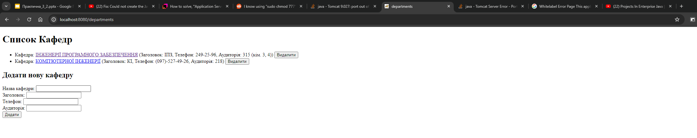
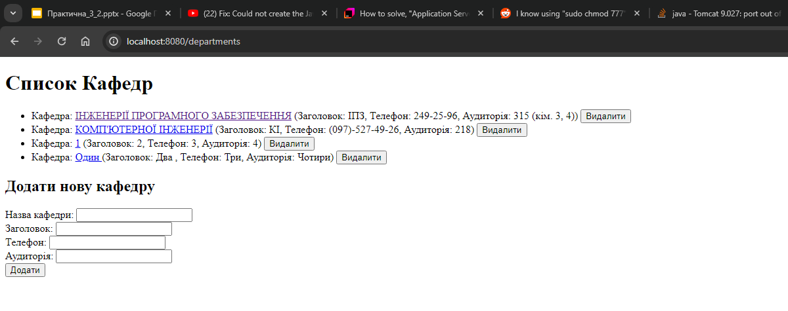
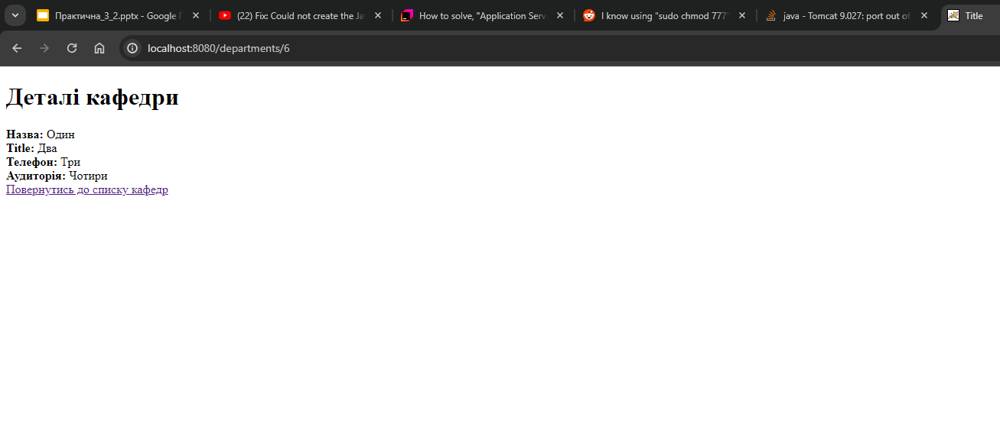
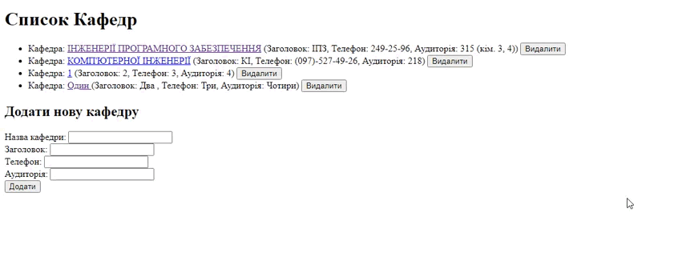

#  Розробка високопродуктивних веб-сервісів на Java з використанням Spring Framework
## Практична 4. Розробка веб-застосунку "Управління кафедрами університету" з використанням Spring Framework

---

### Користувачі можуть переглядати список кафедр, отримувати детальну інформацію про конкретну кафедру,додавати нові кафедри та видаляти існуючі.

---
## Клас ``DemoApplication``
#### Опис:
**Клас** `DemoApplication` є головним класом Spring Boot-проекту. Він містить метод `main`,
який запускає додаток за допомогою Spring Boot. Аннотація @SpringBootApplication вказує на те, що цей клас є точкою входу додатку та включає в себе конфігурацію Spring Boot, таку як автовизначення бинів,
автоконфігурацію та налаштування пакету для сканування компонентів.

### Методи:

`main(String[] args)`: Головний метод, який запускає Spring Boot-додаток.

---
## Клас `Department`
#### Опис:
Клас `Department` представляє модель даних для кафедри. Він містить поля, які описують
основні характеристики кафедри, такі як ідентифікатор, назва, заголовок, телефон та аудиторія.
Аннотації `@Data` та `@AllArgsConstructor` від Lombok автоматично генерують методи доступу
(геттери та сеттери),
метод `toString()`, `equals()`, `hashCode()`, а також конструктор, який приймає всі поля класу.

#### Поля:
``
- `id`: Ідентифікатор кафедри (тип Long).

- `name`: Назва кафедри (тип String).

- `title:` Заголовок кафедри (тип String).

- `phone`: Телефон кафедри (тип String).

- `classroom`: Аудиторія кафедри (тип String).

---
## Клас `DepartmentController`
#### Опис:
**Клас** `DepartmentController` є веб-контролером, який обробляє HTTP-запити,
пов'язані з кафедрами. Він використовує аннотацію `@Controller`,
щоб `Spring` знав, що цей клас відповідає за обробку веб-запитів.
Аннотація `@RequiredArgsConstructor` від `Lombok`
генерує конструктор, який ін'єктує залежність сервісу кафедр `(DepartmentService)`.

### Методи:

- `departments(Model model)`: Метод, який обробляє GET-запит на відображення списку кафедр. Він отримує список кафедр з сервісу та додає його до моделі для відображення.

- `departmentInfo(@PathVariable Long id, Model model)`: Метод, який обробляє GET-запит на отримання інформації про конкретну кафедру за її ідентифікатором.

- `createDepartment(Department department)`: Метод, який обробляє `POST`-запит на створення нової кафедри. Він викликає метод `addDepartment()` сервісу для додавання нової кафедри.

- `deleteDepartment(@PathVariable Long id)`: Метод, який обробляє `POST`-запит на видалення кафедри за її ідентифікатором. Він викликає метод `deleteDepartment()` сервісу для видалення кафедри.

---
## Клас `DepartmentService`
#### Опис:
**Клас** `DepartmentService` надає логіку для роботи з кафедрами. Він
використовує аннотацію `@Service`, щоб позначити себе як сервіс в архітектурі
`Spring`. Клас містить список кафедр та методи для отримання списку кафедр, додавання нової кафедри,
видалення кафедри та отримання інформації про конкретну кафедру за її ідентифікатором.

#### Поля:
- `departments`: Список кафедр (тип List<Department>).

- `ID`: Лічильник для автоматичного генерування унікальних ідентифікаторів кафедр (тип long).
### Методи:

- `listDepartments()`: Метод, який повертає список всіх кафедр.

- `addDepartment(Department department)`: Метод, який додає нову кафедру до списку, призначаючи їй унікальний ідентифікатор.

- `deleteDepartment(Long id)`: Метод, який видаляє кафедру зі списку за її ідентифікатором.

- `getDepartmentById(Long id)`: Метод, який повертає інформацію про конкретну кафедру за її ідентифікатором.
 

---

## Файли шаблонів FreeMarker `department-info.ftlh` та `department.ftlh`
### Опис:
Ці файли містять `HTML`-шаблони для відображення інформації про кафедру та списку кафедр відповідно.
Вони використовують мову розмітки FreeMarker для динамічного відображення даних. 
Шаблони містять логіку для відображення списку кафедр, форми для створення нової кафедри та детальної інформації про
конкретну кафедру.

### Містить:

- Відображення списку кафедр з можливістю видалення та перегляду детальної інформації.

- Форма для створення нової кафедри з обов'язковими полями.

- Відображення детальної інформації про кафедру з можливістю повернення до списку кафедр.

----
Результат

Вивід інформації

Додавання

Детальна інфорація

Результат

<picture>
  <source media="(prefers-color-scheme: dark)" srcset="https://raw.githubusercontent.com/platane/platane/output/github-contribution-grid-snake-dark.svg">
  <source media="(prefers-color-scheme: light)" srcset="https://raw.githubusercontent.com/platane/platane/output/github-contribution-grid-snake.svg">
  
</picture>
