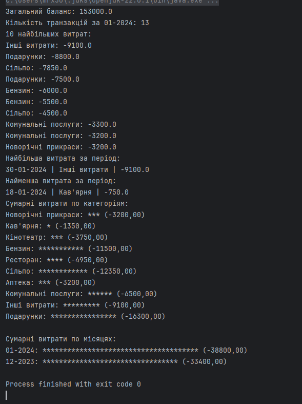
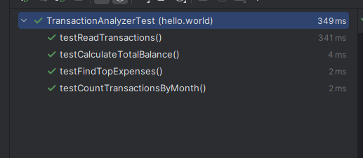

# Самостійна робота №2

# Опис класів

## Клас `Transaktion`
Представляє собою модель транзакції. Він має три поля:
- `date`: Дата транзакції .
- `amount`: Сума транзакції.
- `description`: Опис транзакції .

Він також має гетери та сетери для кожного поля, що дозволяє отримувати та встановлювати значення цих полів. Метод `toString()` перевизначений для виведення інформації про транзакцію у зручному форматі.

## Клас `TransaktionCSVReader`
Цей клас містить метод `readTransactions()`, який використовується для читання CSV-файлу з URL. Він розбиває кожен рядок на значення, створює об'єкт `Transaktion` з цих значень та додає його до списку транзакцій. Цей список потім повертається як результат.

## Клас `TransactionReportGenerator`
Цей клас відповідає за генерацію різних видів звітів про транзакції. Він має наступні методи:
- `printBalanceReport(double totalBalance)`: Друкує загальний баланс. Приймає загальний баланс як параметр.
- `printTransactionsCountByMonth(String monthYear, int count)`: Друкує кількість транзакцій за вказаний місяць. Приймає місяць та кількість транзакцій як параметри.
- `printTopExpensesReport(List<Transaktion> topExpenses)`: Друкує 10 найбільших витрат. Приймає список з 10 найбільших витрат як параметр.
- `printTransaction(Transaktion transaction)`: Друкує окрему транзакцію. Приймає транзакцію як параметр.
- `generateExpenseReport(List<Transaktion> transactions)`: Генерує звіт про витрати, який включає сумарні витрати по категоріям та місяцям. Приймає список транзакцій як параметр.

## Клас `TransactionAnalyzer`
Використовується для аналізу списку транзакцій. Він має наступні методи:
- `calculateTotalBalance()`: Обчислює загальний баланс. Повертає загальний баланс у форматі `double`.
- `countTransactionsByMonth(String monthYear)`: Підраховує кількість транзакцій за вказаний місяць. Приймає місяць як параметр. Повертає кількість транзакцій .
- `findTopExpenses()`: Знаходить 10 найбільших витрат. Повертає список з 10 найбільших витрат.
- `findTopExpenseForPeriod(String startDate, String endDate)`: Знаходить найбільшу витрату за вказаний період. Приймає дату початку та кінця періоду як параметри. Повертає найбільшу витрату у форматі `Transaktion`.
- `findLowestExpenseForPeriod(String startDate, String endDate)`: Знаходить найменшу витрату за вказаний період. Приймає дату початку та кінця періоду як параметри. Повертає найменшу витрату у форматі `Transaktion`.

## Клас `TransactionAnalyzerTest`
 Використовується для тестування методів класу `TransactionAnalyzer`. Має тести для методів `calculateTotalBalance()`, `countTransactionsByMonth()`, `readTransactions()` та `findTopExpenses()`.

## Клас `Main`

- Читає транзакції з CSV-файлу, що знаходиться за  URL, за допомогою методу `readTransactions()` класу `TransaktionCSVReader`. Результатом є список об'єктів `Transaktion`.

- Аналізує прочитані транзакції. Створюється об'єкт класу `TransactionAnalyzer`, до якого передається список транзакцій. За допомогою методів цього класу виконується аналіз транзакцій: обчислюється загальний баланс, підраховується кількість транзакцій за місяць, знаходяться 10 найбільших витрат, знаходяться найбільша та найменша витрати за вказаний період.

- Генерує звіти про транзакції. Для цього створюється об'єкт класу `TransactionReportGenerator`. За допомогою методів цього класу генеруються та друкуються звіти: загальний баланс, кількість транзакцій за місяць, 10 найбільших витрат, окремі транзакції, звіт про витрати.

-------

# Результат

## Тест

<picture>
  <source media="(prefers-color-scheme: dark)" srcset="https://raw.githubusercontent.com/platane/platane/output/github-contribution-grid-snake-dark.svg">
  <source media="(prefers-color-scheme: light)" srcset="https://raw.githubusercontent.com/platane/platane/output/github-contribution-grid-snake.svg">
  
</picture>_
