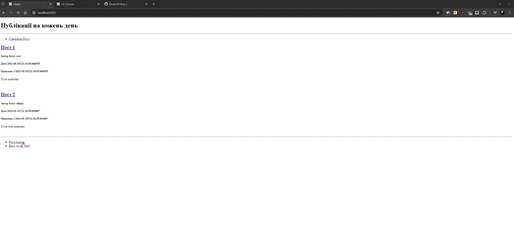
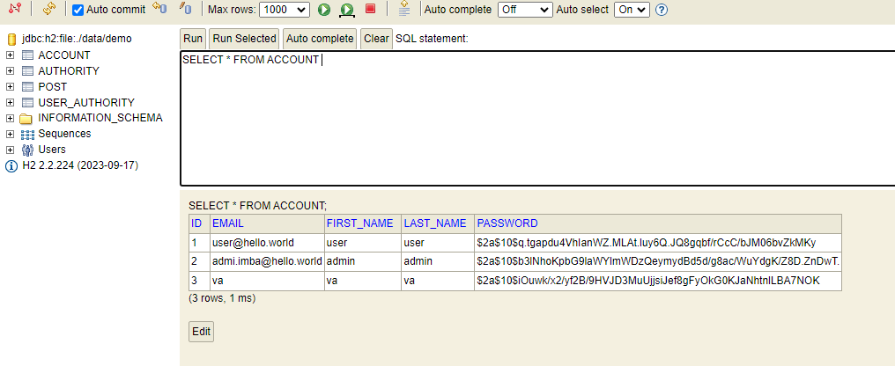
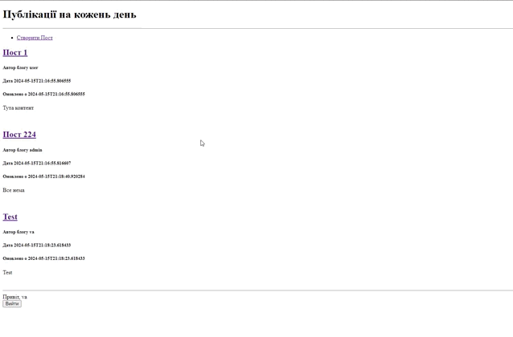
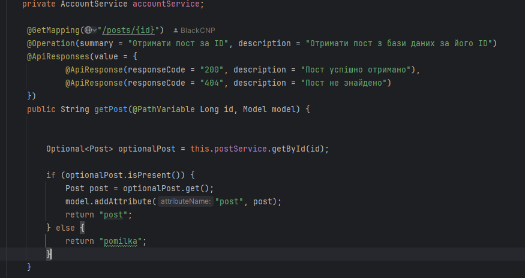
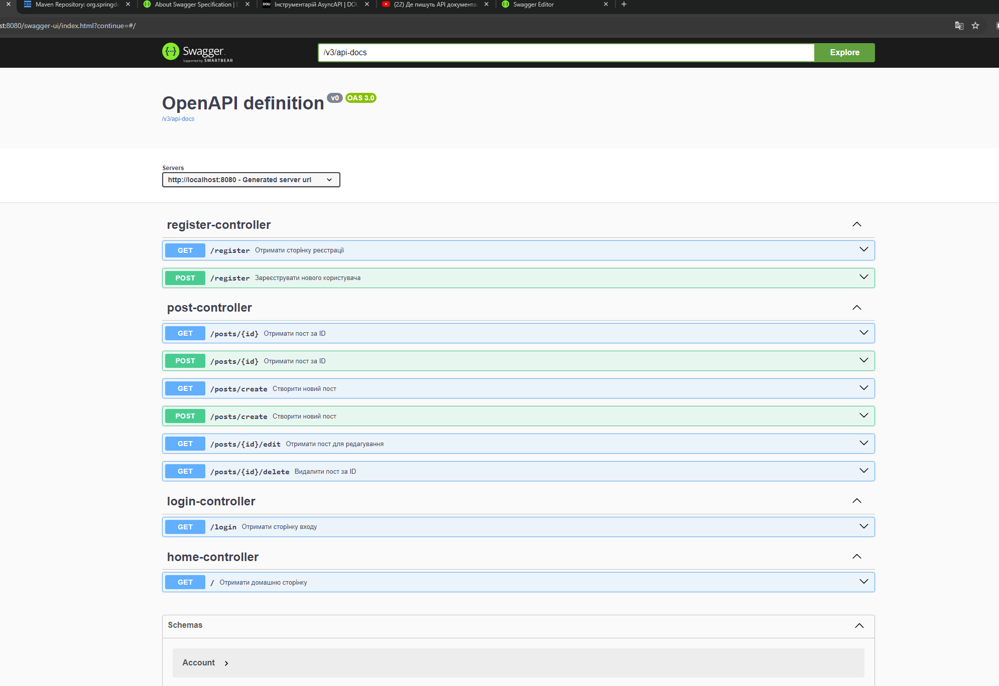

# Курсова


-------
# Додано
http://localhost:8080/swagger-ui/index.html?continue=#/  для перегляду swagger


-------
# Реєстрація та логін



-------
# Додання в БД


----------
# Додавання Публікацій та редагування



---------
# Видалення публікацій


------
# Docer та  Swagger


[Відео з результатами](https://drive.google.com/drive/folders/1IO6kybpU9vI3b_LYfPyijotD9fLwEYGg?usp=sharing)






------
# Тести

## AccountRepositoryTest
```Java
package com.example.kursovav4.repositories;


import com.example.kursovav4.models.Account;
import org.junit.jupiter.api.Test;
import org.springframework.beans.factory.annotation.Autowired;
import org.springframework.boot.test.autoconfigure.orm.jpa.DataJpaTest;
import org.springframework.boot.test.autoconfigure.orm.jpa.TestEntityManager;

import java.util.Optional;

import static org.assertj.core.api.Assertions.assertThat;

@DataJpaTest
public class AccountRepositoryTest {

    @Autowired
    private TestEntityManager entityManager;

    @Autowired
    private AccountRepository accountRepository;

    @Test
    public void whenFindOneByEmail_thenReturnAccount() {

        Account alex = new Account();
        alex.setEmail("test@test.test");
        entityManager.persist(alex);
        entityManager.flush();


        Optional<Account> found = accountRepository.findOneByEmail(alex.getEmail());


        assertThat(found.isPresent()).isTrue();
        assertThat(found.get().getEmail()).isEqualTo(alex.getEmail());
    }
}


```
1. **Створення об’єкта `Account`**: В тесті створюється новий об’єкт `Account` з електронною поштою `test@test.test`.
```java
Account alex = new Account();
alex.setEmail("alex@test.com");
```
2. **Збереження об’єкта в базі даних**: Об’єкт `Account` зберігається в базі даних за допомогою `TestEntityManager`. 
Це тимчасова база даних, яка використовується лише під час виконання тесту.
```java
entityManager.persist(alex);
entityManager.flush();
```
3. **Пошук об’єкта в базі даних**: викликається метод `findOneByEmail` з `AccountRepository` для пошуку
об’єкта `Account` за  цією електронною поштою.
```Java
Optional<Account> found = accountRepository.findOneByEmail(alex.getEmail());
```
4. **Перевірка результату**:  тест перевіряє, чи був знайдений об’єкт, і чи відповідає його електронна 
пошта очікуваній. Якщо об’єкт був знайдений і його електронна пошта відповідає test@test.test, тест вважається пройденим.
```java
assertThat(found.isPresent()).isTrue();
assertThat(found.get().getEmail()).isEqualTo(alex.getEmail());

```


<picture>
  <source media="(prefers-color-scheme: dark)" srcset="https://raw.githubusercontent.com/platane/platane/output/github-contribution-grid-snake-dark.svg">
  <source media="(prefers-color-scheme: light)" srcset="https://raw.githubusercontent.com/platane/platane/output/github-contribution-grid-snake.svg">
  

</picture>
